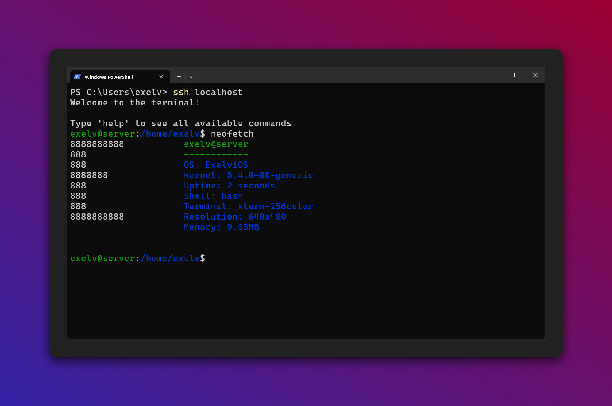

# [terminal](https://github.com/EXELVI/ssh-terminal)

This is a ssh terminal made in node.js with ssh2. 



## Features

- Command execution: Users can enter commands and see the output directly in the terminal.
- File system navigation: Users can navigate through directories, list files, and perform basic file operations.
- Command history: Users can access previously executed commands using the up and down arrow keys.
- Autocomplete: Users can use the tab key to autocomplete commands and file paths.
- User management: Users can create, delete, and modify user accounts.
- Alias creation: Users can create aliases for commands.
- Game integration: Users can play games like 2048, Connect 4, Snake, Rock Paper Scissors, and Tic Tac Toe.

## Installation

To install the terminal, follow these steps:

1. Clone the repository:

```bash 
git clone https://github.com/EXELVI/ssh-terminal.git
```

2. Install the dependencies:

```bash
npm install
```

3. Rename the `db.json.example` file to `db.json` (delete the existing `db.json` file if it exists):

```bash
mv db.json.example db.json
```

4. Start the server:

```bash
npm start
```

5. Connect to the terminal using an SSH client:

```bash
ssh localhost
```
or 
```bash
ssh <username>@localhost
```


## Commands


> Note: You can use `sudo` before a command to run it as the root user.

> Note: You can use `> [filename]` at the end of a command to save the output to a file.
| Command | Description | Usage | Notes |
| ------- | ----------- | ----- | ---- |
| `2048` | Play the 2048 game | `2048` | |
| `adduser` | Create a new user | `adduser [username]` | |
| `alias` | Create an alias for a command | `alias [name] [command]` | |
| `cat` | Display the content of a file | `cat [filename]` | |
| `cd` | Change the current directory | `cd [directory]` | Using `..` will move up one directory, and using `~` will move to the home directory. |
| `clear` | Clear the terminal screen | `clear` | |
| `connect4` | Play the connect 4 game | `connect4` | |
| `cp` | Copy a file or directory | `cp [source] [destination]` | |
| `curl` | Fetch a file from the internet | `curl [url]` | |
| `date` | Display the current date and time | `date` | |
| `echo` | Print text to the terminal | `echo [text]` | |
| `exit` | Exit the terminal | `exit` | |
| `help` | List all available commands | `help` | |
| `ls` | List files and directories | `ls [directory]` | Using `-a` will show hidden files, and using `-l` will show detailed information. |
| `mkdir` | Create a new directory | `mkdir [directory]` | |
| `mv` | Move a file or directory | `mv [source] [destination]` | |
| `neofetch` | Display system information | `neofetch` | |
| `passwd` | Change user password | `passwd [username]` | Leaving out the username will change the current user's password. |
| `pwd` | Print the current working directory | `pwd` | |
| `rm` | Delete a file or directory | `rm [file]` | |
| `rockpaperscissors` | Play the rock paper scissors game | `rockpaperscissors` | |
| `sh` | Run a shell command | `sh [command]` | |
| `snake` | Play the snake game | `snake` | |
| `stats` | Display user statistics | `stats` | |
| `su` | Change user | `su [username]` | Leaving out the username will switch to the root user. |
| `tictactoe` | Play the tic tac toe game | `tictactoe` | |
| `touch` | Create a new file | `touch [filename]` | |
| `tree` | Display the directory tree | `tree` | |
| `unalias` | Remove an alias | `unalias [name]` | |
| `userdel` | Delete a user | `userdel [username]` | |
| `usermod` | Modify user account | `usermod [username]` | |
| `wget` | Download a file from the internet | `wget [url]` | |
| `whoami` | Display the current user | `whoami` | |
> [] means required, () means optional


## Special Users

The terminal has the following special users:

- `root`: The root user has access to all commands and can perform any operation.
- `2048`: On connecting to the terminal, the user will automatically start playing the 2048 game.
- `connect4`: On connecting to the terminal, the user will automatically start playing the Connect 4 game.
- `snake`: On connecting to the terminal, the user will automatically start playing the Snake game.
- `rockpaperscissors`: On connecting to the terminal, the user will automatically start playing the Rock Paper Scissors game.
- `tictactoe`: On connecting to the terminal, the user will automatically start playing the Tic Tac Toe game.
- `clock`: On connecting to the terminal, the user will automatically see a ASCII real-time clock (HH:MM:SS).
- `rick`: Just imagine what this user does. :D (Resize the terminal to see the magic, recommended 142x42 cols x rows)


## Contributing

Contributions are welcome! If you find any issues or have suggestions for improvements, please open an issue or submit a pull request on the GitHub repository.

